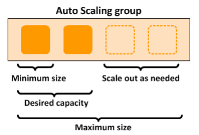
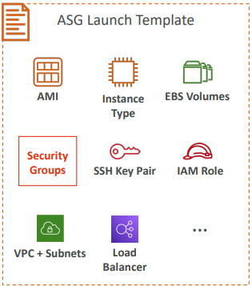
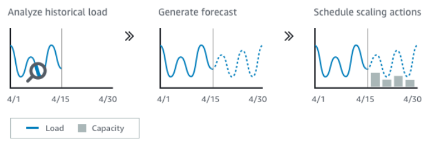
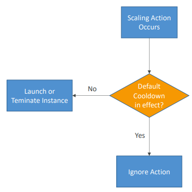

# Auto Scaling

Permite fazer `scale-out` e `scale-in` para expandir e retrair a capacidade computacional na nuvem com base na demanda.

Pode ser usado para escalar instâncias EC2, tasks do ECS, tabelas e índices do DynamoDB e Read Replicas do Amazon Aurora.

É possível selecionar o número mínimo de instâncias em execução, o número máximo e a capacidade inicial desejada.

---

## Groups

Unidade lógica que organiza um conjunto de instâncias EC2 com configurações idênticas em um agrupamento.

---

## Políticas de Escalabilidade

São os gatilhos do `scale-out/in` do Auto Scaling. Suporta dimensionamento manual (alterar a capacidade máxima, mínima e desejada), escala baseada em uma programação (em função de uma data e hora), escalabilidade dinâmica com base em demanda (utilização de CPU do ASG). É possível utilizar CloudWatch Alarm como gatilho e `Custom Metric`, uma métrica específica que você define na instância EC2, envia para o CloudWatch com a `PutMetric` API e cria um Alarm.

---

## Modelo de Configuração

Modelo de configuração de instância que um Auto Scaling Group usa para iniciar instâncias do EC2.

Contém as definições das instâncias a serem adicionadas ao grupo. Você configura AMI, o tipo de instância, escolhe se será Spot Instance, o Security Group, Key Pair, Rede, User Data e etc.

É possível fazer forecast contínuo de previsão da capacidade:

---

## Outras informações

* Se você excluir um ASG com instâncias em execução, as instâncias serão encerradas e o ASG excluído;

* Para aumentar a disponibilidade, você pode habilitar o balanceamento de recursos em zonas de disponibilidade diferentes. O Auto Scaling equilibra automaticamente as instâncias entre as AZs quando o recurso `Várias Zonas` está habilitado nas definições do ASG;

* Auto Scaling é grátis, você paga pelos recursos que ele cria (EC2, EBS);

* Auto Scaling pode terminar instâncias classificadas como `não saudáveis/ unhealth` pelo Load Balancer;

* É um recurso regional, não suporta cross-region;

* Um Auto Scaling Group é associado a uma Configuração de Execução de cada vez, e você não pode modificá-la depois de criá-la. Para alterar a Configuração de Execução de um ASG, use a configuração existente como base para criar uma nova e, em seguida, atualize o grupo do Auto Scaling para usar a nova configuração;

* Quando você altera a Configuração de Execução para um ASG, todas as novas instâncias criadas serão ativadas usando as novas opções de configuração, mas as instâncias existentes não serão afetadas. Para atualizar as instâncias existentes, termine-as para que sejam substituídas por novas instâncias;

* Para utilizar o Elastic Load Balancer com Auto Scaling, basta registrar o ELB no Auto Scaling Group;

* **Rebalanceamento de Capacidade**: quando você trabalha com escalonamento de instâncias spot, ao habilitar o rebalanceamento no ASG, o Auto Scaling tenta criar uma nova instância spot sempre que o EC2 notifica que uma instância spot está em um risco elevado de interrupção. Depois de iniciar a instância nova ele termina a antiga;

* **Logs do CloudTrail**: você pode registrar as chamadas as APIs do Auto Scaling e armazenar os logs em um bucket S3 que você especificar. Os logs incluem quais solicitações foram feitas, os endereços IP de onde as solicitações vieram, quando a solicitação foi feita e etc;

* **Notificações do SNS**: você pode configurar grupos do Auto Scaling para enviar notificações do SNS sempre que o Auto Scaling incluir ou terminar instâncias.

---

## Cooldown

Depois que uma atividade de scaling ocorre, você fica em `cooldown period` (default 300 s).

Durante o período de cooldown, o ASG não irá lançar ou terminar instâncias (para permitir que as métricas estabilizem).

