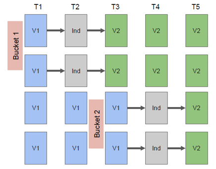

# Elastic Beanstalk

Cria ambientes para rodar aplicações web. Você fornece o código e o Elastic Beanstalk gera a infra necessária para rodar a aplicação.

Beanstalk é grátis, você paga somente pelos recursos que ele cria.

É possível criar a arquitetura de 3 níveis (three tier).

Beanstalk utiliza CloudFormation para criar os recursos.

**3 tipos de arquitetura:**

* Single instance deployment: 1 instância apenas. Ideal para teste;
* LB + ASG: ideal para pré-produção e produção de aplicações web;
* ASG only: ideal para não web servers.

Possui 3 componentes:

* Application: coleção lógica de componentes do Beanstalk, incluindo ambientes, versões e configurações de ambiente. No Elastic Beanstalk, uma aplicação é conceitualmente semelhante a uma pasta;
* Application Version: se refere a uma iteração rotulada específica do código implantável de uma aplicação web;
* Environment Name (prod, dev): qualquer nome que você quiser dar.

Application Version são implantadas em Environments, que só podem rodar um Application Version por vez.

Rollback: restaura a versão anterior.

---

## Modalidades de Deployment

**All at once**

* Publicação rápida
* Aplicação para de funcionar durante o deploy
* Ideal para desenv
* Não tem custo adicional

**Rolling**

* Aplicação roda com capacidade menor
* Tamanho do bucket é ajustável
* Aplicação roda duas versões ao mesmo tempo
* Não tem custo adicional
* Demora mais que All at Once

**Rolling with aditional batches**

* Aplicação roda com capacidade total
* Tamanho do bucket ajustável
* Aplicação roda duas versões ao mesmo tempo
* Instâncias adicionais são terminadas no final
* Demora mais
* Ideal para produção

**Immutable**

* Zero Down Time
* Novo código é publicado para um novo ASG
* Custo maior
* Rápido rollback em caso de falhas
* Ideal para produção

**Blue/Green Deployment**

* Cria um environment novo com a nova versão
* Weighted Policy
* Pode usar o recurso `Swap URL` do Beanstalk para fazer o rollback

**Comparação dos mecanismos de deployment**

