# Elastic Compute Cloud (EC2)

Serviço de máquinas virtuais na nuvem.

* [1. Mecanismos de Armazenamento](#1-mecanismos-de-armazenamento)
* [2. Rede e Segurança](#2-rede-e-segurança)
* [3. User Data](#3-user-data)
* [4. AMI](#4-amazon-machine-image-ami)
* [5. Instance States](#5-estados-de-uma-instância)
* [6. Preço](#6-definição-de-preço)
* [7. Hosts Dedicados](#7-hosts-dedicados)
* [8. Spot Instances](#8-spot-instances)
* [9. Placement Group](#9-placement-group)
* [10. Rede](#10-rede)
* [11. Problemas Comuns](#11-problemas-de-execução-de-instâncias)

---

## 1. Mecanismos de Armazenamento

**Elastic Block Storage (EBS)**

Para dados persistentes que independem do estado da instância.

---

**Instance Store**

Para dados temporários e de acesso rápido.

---

**Elastic File System (EFS)**

Para dados compartilhados entre várias instâncias.

---

**Simpes Storage Service (S3)**

Para dados de backup.

---

## 2. Rede e Segurança

**Elastic Fabric Adapter (EFA)**

Oferece escalabilidade, flexibilidade e elasticidade para aplicativos HPC.

Latência menor e mais consistente com maior throughput que canais tradicionais de TCP.

---

**Elastic IP**

IP público constante para a EC2.
Há um limite de 5 endereços Elastic IP por Region (por conta da escassez do IPv4).

É cobrada uma taxa a cada hora em que o Elastic IP não está sendo utilizado (taxa de conscientização). Use apenas em dev, em prod use Route 53/ Load Balancar para expor sua aplicação.

---

**Security Group**

Firewall da instância EC2.

Todo `inboud traffic` bloqueado por padrão.

Todo `outbound traffic` liberado por padrão.

Pode usar o mesmo SG para várias instâncias e é possível modificar as regras de um SG a qualquer momento.

Pode-se referenciar um Security Group em outro Security Group.

Security Group é `statefull` -> a resposta de um tráfego de entrada tem permissão para sair da instância mesmo que não tenha um outbound rule permitindo a saída do tráfego.

Exemplo: Se eu mandar uma requisição de ping para uma instância, ela me responde mesmo que não tenha uma outbound rule liberando a porta de ICMP para essa instância. Para impedir isso, é preciso configurar uma Network ACL para a subnet. NACL é `stateless` e, portanto, não permite automaticamente o tráfego de resposta.

Exemplo de regras de entrada para servidor web:

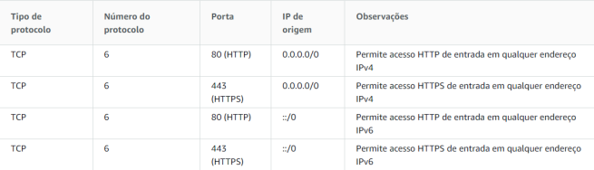

---

Exemplo de regras de entrada para bancos de dados (a origem pode ser um CIDR ou ID de Security Group)

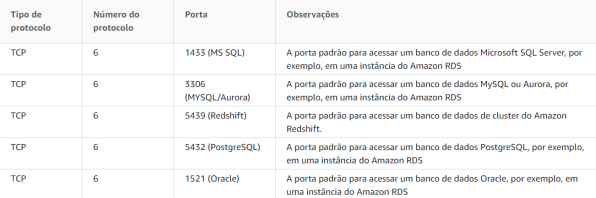

---

Exemplo de regras de entrada para conexão remota a partir de outro computador

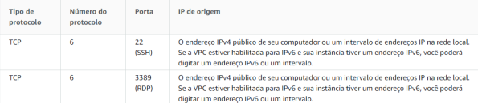

---

Exemplo de regra de entrada para conectar em uma instância a partir de outra instância com o mesmo Security Group.

---

## 3. User Data

Comando que é executado uma única vez quando sua instância é iniciada. O código roda com permissão de root user. Você pode rodar para fazer instalações e configurações iniciais.

---

## 4. Amazon Machine Image (AMI)

Imagem da máquina virtual.

Podem ser personalizadas usando `user data`. Também há uma variedade de AMIs disponíveis no AWS Marketplace (Alteryx, Tableau,...).

Escopo = VPC

Ciclo de vida da AMI

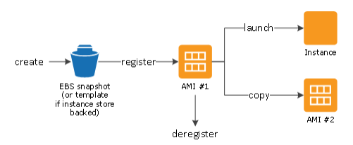

Você pode criar novas instâncias a partir da AMI.

Você pode copiar uma AMI dentro da mesma Region ou em uma Region diferente.

Após criar uma AMI, você pode mantê-la privada e restrita somente para você ou compartilhá-la com uma lista específica de contas AWS.

Você também pode torná-la pública para toda a comunidade AWS.

---

## 5. Estados de uma Instância

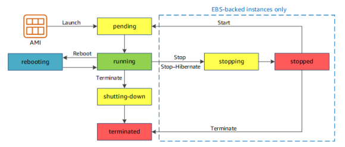

**Hibernate**

Salva uma cópia da memória RAM no disco EBS da instância. Quando ela é reinicializada, ela volta no estado em que estava, com os mesmos dados na memória. É ideal para aplicações que demoram muito para carregar.

Você não é cobrado pela instância enquanto ela está no estado de `stopped`, mas é cobrado enquanto ela está em `stopping` pois neste instante os dados da RAM estão sendo transferidos para o disco EBS (você não é cobrado pela transferência, só pelo armazenamento).

Para poder usar o Hibernate, você deve habilitar essa opção no momento de criação da instância (não é possível habilitar em uma instância existente). Além disso, a criptografia do volume EBS deve estar habilitada.

Hibernate não é habilitado com Instance Store (por conta de não persistir dados nesse modelo de storage).

A RAM precisa ter menos de 150 GB e deve haver espaço suficiente no EBS para armazenar o conteúdo da RAM.

> **Obs.:** uma instância não pode ficar em estado de `hibernate` por mais de 60 dias. 

---

## 6. Definição de preço

**On demand**

Modalidade de gasto mais cara. Você paga por hora ou segundo de máquina em execução (com mínimo de 60 segundos).

Itens que compõem o custo da instância:

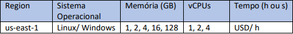

A cobrança em segundos é feita em cima de frações de horas de instância em execução.

Sua fatura também é composta por uma parcela associada a transferência de dados.

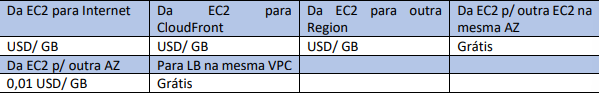

Muito indicada para instâncias de desenvolvimento, para workloads com curto ciclo de vida ou ciclo de vida desconhecido.

---

**Instâncias Reservadas (RI)**

Desconto de até 72% comparado com o on demand:

* RI Padrão: ideal para uso constante (até 72% desconcto);
* RI Conversível: capacidade de alterar os atributos da RI (54% de desconto) para valores iguais ou superiores;
* RI Programada: são disponibilizadas para lançamento dentro da janela de tempo reservada.

Você tem três opções de pagamento: adiantado integral, adiantado parcial e sem pagamento adiantado.

---

## 7. Hosts dedicados

Servidor físico totalmente dedicado ao seu uso. Você consegue especificar em qual host dedicado sua instância será executada após ela ter sido interrompida ou reiniciada. Você também pode permitir que o Amazon EC2 insira as instâncias automaticamente.

---

## 8. Spot Instances

Uso da capacidade ociosa da Amazon. Desconto de até 90% com relação ao On Demand.

Sinal de `rebalanceamento de instância spot` = sinal que avisa quando uma instância spot tem risco elevado de interrupção. O sinal oferece oportunidade de gerenciar proativamente a instância antes do aviso de interrupção de dois minutos.

---

## 9. Placement Group

Serve para determinar o posicionamento físico de um grupo de instâncias interdependentes. 

Não há custo para criação de um placement group.

Pode ser:

**Cluster**

Agrupa instâncias em uma AZ. Entrega alta performance de rede, baixa latência para comunicação de nó a nó, típica de HPC.

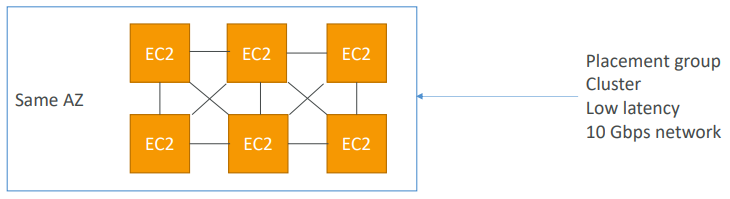

Prós: rede (10 Gbps de largura de banda entre as instâncias com enhanced networking habilitado).

Contras: Se a AZ falhar, todas as instâncias falham.

Use Cases: trabalhos de Big Data que precisam completar rapidamente, aplicações que precisam de latência extremamente baixa e alto throughput de rede.

---

**Partition**

Distribui instâncias entre partições lógicas, de modo que instâncias em uma partição não compartilhem hardware subjacente com grupos de instâncias em diferentes partições. Ideal para workloads distribuídos e replicados, como Hadoop (HDFS) e Kafka.

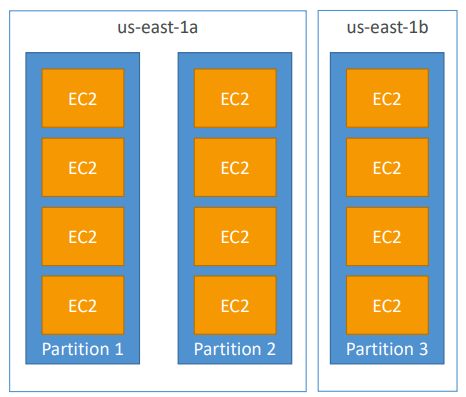

Cada partição é um rack e as partições podem ser criadas em AZs diferentes.

Uma falha em uma partição pode afetar muitas instâncias, mas não afeta outras partições.

As instâncias EC2 podem acessar informações das partições como `metadata`.

---

**Spread**

Posiciona estritamente um pequeno grupo de instâncias por hardware subjacente distinto a fim de reduzir falhas correlacionadas. As instâncias são colocadas em racks diferentes.

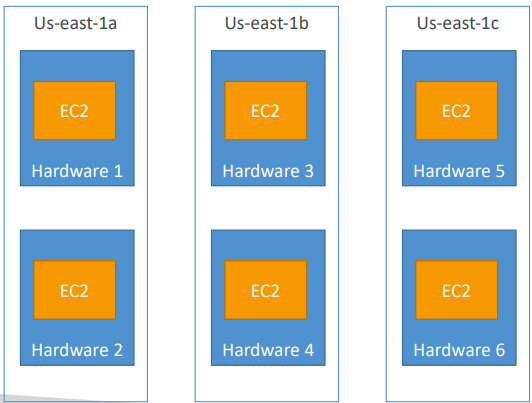

Podem ser colocadas em AZs diferentes e reduz o risco de falha simultânea, porém, é limitado a 7 instâncias por AZ por placement group.

Use Cases: Aplicações que precisam maximizar a alta disponibilidade e aplicações criticas onde cada instância precisa ser isolada de falhas uma das outras.

---

## 10. Rede

**Elastic Network Interfaces (ENI)**

Componente lógico de uma VPC que representa um `cartão de rede virtual`.

A ENI pode ter as seguintes propriedades:

* IPv4 privado primário
* Um ou mais IPv4 privados secundários
* Um IPv4 público
* Um ou mais security groups
* Um MAC address

É possível criar ENI de forma independente e atachar nas instâncias EC2 (geralmente, com propósito de failover)

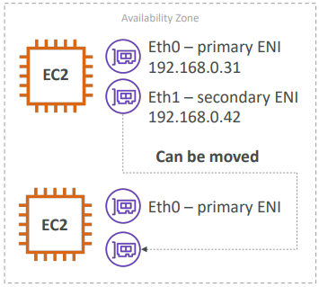

---

**EBS**

Quando o volume EBS raiz de uma instâncias é substituído, a instância é reinicializada e o conteúdo da memória RAM se perde.

Não é possível substituir o volume raiz do Instance Store.

---

## 11. Problemas de execução de instâncias

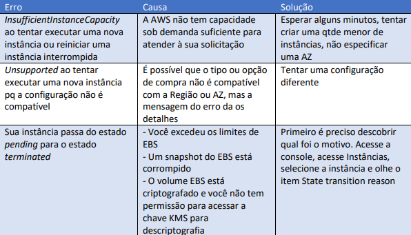

---

**Problemas de timeout na conexão**

* Cheque o Security Group da instância e veja se o acesso de entrada é permitido na porta desejada;
* Cheque o Route Table da VPC. Você precisa de uma rota que envie todo o tráfego que sai da VPC para o Internet Gateway;
* Verifique o Network ACL da subnet. Ele deve permitir o tráfego de entrada do seu IP na porta desejada e também o tráfego de saída para as portas efêmeras `(1024-65535)`;
* Cheque o firewall do seu computador, se é permitido acesso a porta desejada;
* Verifique se sua instância EC2 tem um endereço IPv4 público;
* Verifique a carga de CPU da sua instância.