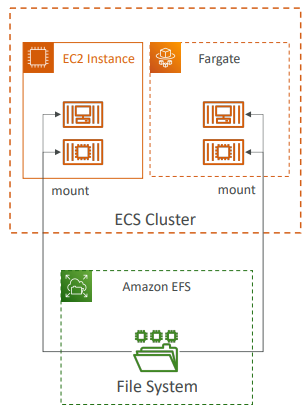
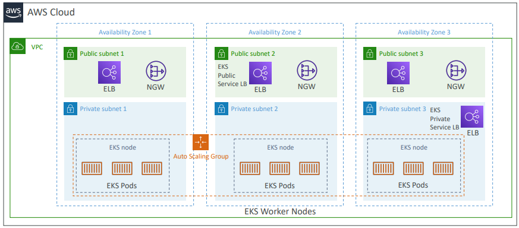

# ECS - Elastic Container Service

Serviço de gerenciamento de contêineres altamente escalável e rápido que roda Docker. O ECS pode ser usado para criação e implantação consistente para gerenciar e escalar workloads batch e de ETL e para criar arquiteturas de aplicações sofisticadas em um modelo de microsserviço.

ECS é um recurso regional que executa contêineres de forma altamente disponível em várias AZs.

Na AWS existem as seguintes tecnologias de conteiners:

**Amazon Elastic Conteiner Service (Amazon ECS)**

Plataforma de conteiners da AWS,

**Amazon Elastic Kubernetes Service (Amazon EKS)**

Kubernetes gerenciado pela AWS.

**AWS Fargate**

Plataforma de conteiners serverless da AWS. Trabalha com ECS e EKS.

**Amazon Elastic Conteiner Registry (ECR)**

Repositório de imagem de conteiers (como o Docker Hub). ECR pode ser privado ou público (Amazon ECR Public Gallery)


**Custo:** O ECS não tem custo, você paga pelas instâncias EC2, volumes EBS e recursos que ele utiliza.

---

## Conceitos

**Conteiners e imagens**

Para implantar aplicações no ECS, os componentes da aplicação devem ser projetados para execução em conteiners. Um conteiner é uma unidade padronizada de desenvolvimento de software que contém tudo que a aplicação de software precisa para ser executada, incluindo o respectivo código, tempo de execução, ferramentas e bibliotecas de sistema. Os conteiners são criados a partir de um modelo de leitura chamado `imagem`.

Normalmente, imagens são criadas de um `DockerFile`, um arquivo de texto simples que especifica todos os componentes incluídos no conteiner. Depois de serem criadas, essas imagens são armazenadas em um `Registry`, de onde podem ser baixadas e executadas no cluster.


Diagrama de objetos do ECS:


**Cluster**

É um agrupamento lógico de Tasks ou Serviços. Você pode registrar uma ou mais instâncias do EC2 (instâncias de conteiners) no cluster para executar Tasks. Quando você utiliza o `Fargate`, o cluster é gerenciado pela AWS.

**Agent do Conteiner**

O agente é executado em cada instância de conteiners em um cluster do ECS. O agent envia para o ECS informações sobre as atuais Tasks do recurso em execução e a utilização dos recursos. Ele inicia e interrompe Tasks sempre que recebe uma solicitação do ECS. O agent permite que instâncias de conteiners (EC2) se conectem ao seu cluster (ECS).


**Task Definition**

É um arquivo de texto (JSON) que descreve um ou mais conteiners (até o maáximo de 10) que compõem a aplicação. A definição de Task pode ser considerada um esquema da aplicação. Esses parâmetros podem ser usados para indicadr os containers que devem ser usados, as portas que devem ser abertas para a aplicação e os volumes de dados que devem ser usados com os containers na task. Basicamente, são os metadados, e também podem receber environment variables, cpu, etc.

Exemplo de um Task Definition:

```json
{
    "family": "webserver",
    "containerDefinitions": [
        {
            "name": "web",
            "image": "nginx",
            "memory": "100",
            "cpu": "99"
        },
    ],
    "requiresCompatibilities": [
        "FARGATE"
    ],
    "networkMode": "awsvpc",
    "memory": "512",
    "cpu": "256",
}
```

**Task**

É uma instância de uma Task Definition dentro de um cluster. Depois de criar um Task Definition para a aplicação no ECS, é possível especificar o número de Tasks que serão executadas no cluster.

O `Programador de Tasks` do ECS é responsável por posicionar Tasks no Cluster. Você pode definir um `Service` que executa e mantém um número de tarefas especificado simultaneamente.


> **Obs.:** Precisa anexar a policy `Amazon ECS Container Service Task Role` a Task para permitir execução.

**Service**

É basicamente o orquestrador de tasks, define quantas devem rodar e como elas devem rodar. Pode-se associar um ELB ao Service para distribuir tráfego entre as tasks (mas precisa ser Application Load Balancer para utilizar o recurso de Dynamic Port Mapping).


---

## Procedimento para criação do Cluster

* Criar instâncias do EC2
* Configurar o arquivo `etc/ecs/ecs.config` com o nome do cluster
* Instalar o ECS Agent na EC2
* Especificar a porta do Conteiner (não do host)
* Utilizar ALB com Dynamic Port Mapping
* Configurar Security Groups do EC2 para permitir tráfego do ALB em todas as portas
* ECS Tasks podem ter IAM Roles para executar ações na AWS
* Security Groups operam no nível instância EC2, não no nível Task

---

## Segurança

Para que as Tasks acessem outros serviços, é preciso attachar as policies do IAM necessárias a Role `Amazon EC2 Container Service Task Role` do Task Definition. Se dentro da Task você também têm containers que precisam de permissões específicas que não podem ser aplicadas a todos os containers da Task, você precisa colocar esses containers em outro Task Definition e attahcar a policy específica para eles.


**EC2 Instance Profile (EC2 Launch Type)**

* Usada pelo ECS Agent
* Faz chamadas de API so serviço do ECS
* Envia logs dos containers ao CloudWatch
* Faz Docker Pull das imagens do ECR
* Referencia dados sensíveis no Secrets Manager ou SSM Parameter Store

**ECS Task Role**

* Habilita cada task ter uma role específica
* Usa diferentes roles para diferentes Services do ECS que você executa
* Task Role é definida no Task Definition

---

## Fargate

Com uso do Fargate, a AWS gerencia o cluster, você só precisa criar o Task Definition. Para escalonar, só é preciso ajustar o Task Number (e não criar mais instâncias EC2).

---

## Data Volumes

* Montagem de EFS File System na ECS Task
* Funciona com EC2 e Fargate Launch Type
* Tasks executando em qualquer AZ compartilham o mesmo dado no EFS file system
* Fargate + EFS = Serverless

> **Obs.:** Amazon S3 não pode ser montado como um file system.



---

## Auto Scaling


---

## EKS



**EKS Node Types**

* Managed Node Groups
    * Você cria e gerencia os nodes (EC2)
    * Nodes são parte de um ASG gerenciado pelo EKS
    * Suporta On-demand e Spot Instances
* Self-Managed Nodes
    * Você cria os nodes e os registra no EKS cluster, mas são gerenciados pela AWS
    * Você pode utilizar AMI template - Amazon EKS Optimized AMI
    * Suporta On-demand e Spot Instances
* AWS Fargate
    * Totalmente gerenciado pela AWS

