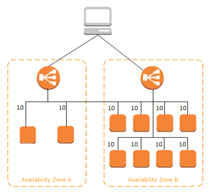
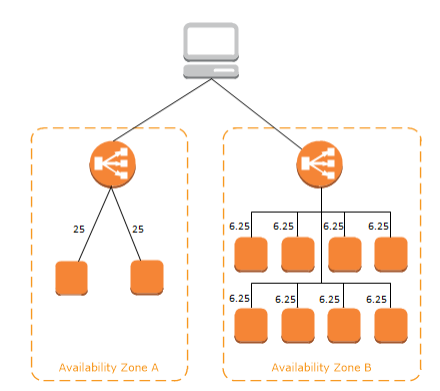

# Elastic Load Balancer (ELB)

Distribui automaticamente seu tráfego de entrada entre vários destinos, como instâncias EC2, contêineres e endereços IP, em uma ou mais AZs.

Também monitora a integridade dos destinos registrados (health check) e torei o tráfego apenas para destinos íntegros.

Separa tráfego público de privado.

---

## Health Check

Aplicado em um caminho na instância onde você especifica e se a resposta não for 200 (OK) a instância é classificada como `unhealth`.

Você configura seu LB especificando um `listener`, que é um processo que verifica se há solicitações de conexão. Ele é configurado com um protocolo e um número de porta.

---

## Balanceamento de Carga entre Zonas

Quando habilitado, cada nó do LB distribui tráfego aos destinos registrados em todas as zonas de disponibilidade habilitadas. Se não tiver habilitado, o LB distribui apenas para os destinos registrados na respectiva zona de disponibilidade.

No exemplo acima, com balanceamento de carga entre zonas habilitado, cada um dos 10 destinos recebe 10% do tráfego. Isso acontece porque cada nó do LB recebe 50% do tráfego (há dois nós) e a requisição que chega por uma AZ pode ser direcionada para outra.

Se não fosse habilitado o balanceamento de carga entre zonas, cada destino na AZ A receberia 25% de tráfego e cada destino na AZ B receberia 6,25% de tráfego, o que geraria uma carga desigual nos destinos.

* Com `Application Load Balancer` o balanceamento de carga entre zonas está sempre habilitado;

* Com `Network Load Balancer` o balanceamento de carga entre zonas está sempre desabilitado por padrão.

---

## Application Load Balancer (ALB)

Ideal para a maioria das aplucações e para trabalhar com contêineres (Docker).

Atua na camada de aplicação (layer 7 - OSI). Suporta protocolos HTTP e HTTPS.

Suporta múltiplas aplicações HTTP em máquinas diferentes (Target Group) e na mesma máquina (Contêineres).

`Stickness` pode ser habilitado no Target Group para que a mesma requisição seja direcionada para a mesma máquina.

Recurso `Port Mapping` para redirecionar para porta dinâmica.

---

## Network Load Balancer (NLB)

Ideal para aplicações com alto volume de tráfego e alto desempenho.

Atua na camada 4.

Menor latência (NLB = 100 ms e ALB = 400 ms).

Direciona tráfego TCP para instâncias.

---

## Erros

* Erros 4XX são gerados no lado cliente;

* Erros 5XX são gerados pela aplicação;

* Erro 503 significa `Capacidade Máxima Atingida`;

* Se o ELB não se comunicar com a aplicação, provavelmente o problema é Security Group.

---

## Rede

É possível acessar as APIs do ELB de modo privado por meio de VPC Endpoints sem a necessidade de um gateway de internet, um NAT Gateway ou uma VPN.

A geração mais recente de endpoints da BPC usados pelo ELB é desenvolvida pelo `AWS PrivateLink`, uma tecnologia da AWS que permite conectividade privada entre os produtos da AWS usando `Interfaces de Rede Elástica (ENI)` com IPs privados nas suas VPCs.

---

## Diversos

* As chamadas as APIs do ELB são registradas no AWS CloudTrail;
* Você pode integrar o AWS WAF ao ELB para proteger sua aplicação contra ataques;
* Você pode balancer carga para destinos no VPC do ELB, para qyalquer endereço IP para destinos fora do VPC do ELB (VPC Emparelhada e para ambiente On-Premises acessíveis por meio do AWS Direct Connect ou VPN).

---

## Target Group

É usado para rotear solicitações para um ou mais destinos registrados. Ao criar cada regra do `listener`, especifique um target group.

Quando uma condição de regra é atendida, o tráfego é encaminhado para o target group correspondente. Você pode criar target groups diferentes para tipos diferentes de solicitações.

Target Type = Instance, IP, Função Lambda.

---

## Logs de Acesso

Além do CloudTrail, o ELB tem um recurso desabilitado por padrão de registrar as solicitações que chegam em logs salvos em um bucket S3 que você escolher. A geração dos logs não é cobrada, só o armazenamento deles no S3.

Também ficam registradas as solicitações que não chegaram nos recursos por terem sido barradas no Load Balancer, como requisições mal intencionadas.