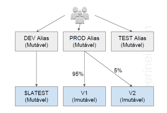
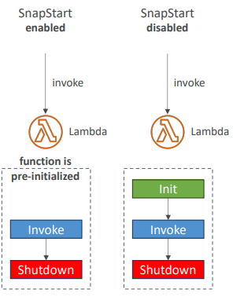

# Lambda

Capacidade computacional serverless que permite executar códigos sem provisionar servidores. Você é cobrado pelo tempo de execução do código. Além do tempo de execução, você é cobrado pelas transferências de dados entre o Lambda e outros serviços e pelo número de requisições.

* Lambda faz escalonamento automático;
* Linguagens: Node Js, Java, Python, C#, Go, Power Shell;
* Podemos alocar qualquer valor de memória para a função de 128 MB até 10 GB, com incrementos de 1 MB;
* Pode ser colocada dentro de um VPC + Security Group;
* Deve-se associar a uma IAM Role;
* **Concurrency**: até 1.000 execuções simultâneas;
* Cada chamada que ultrapassa o concurrency limit dispara um throttle da seguinte forma:
    * Synchronous Invocation: retorna ThrottleError 429;
    * Assynchronous Invocation: tenta novamente e depois envia o evento para um Dead Letter Queue.

AWS Lambda armazena o código no S3 e o criptografa enquanto está ocioso.

Cada função Lambda recebe 500 MB de espaço em disco não persistente em seu próprio diretório `/tmp` (se precisar de mais espaço, use o EFS como sistema NFS elástico, basta acessar o endpoint do EFS) - Nesse caso, a função precisa estar configurada para acessar o VPC do EFS (que fica em uma subnet).

Não há limites para o número de funções que você pode ter.

Lambda é integrado com CloudTrail para auditar as chamadas as funções.

Também é integrado com CloudWatch para analisar logs de execução das funções.

---

## Conceitos

**Function**

Recurso que você pode invocar para executar o código no Lambda

**Trigger**

Acionador ou configuração que invoca uma função do Lambda, Um trigger pode ser um serviço da AWS.

**Evento**

Documento no formato JSON que contém dados para uma função do Lambda processar. Exemplo de evento de dados climáticos:

```json
{
    "TemperatureK": 281,
    "WindKmh": -3,
    "HumidityPct": 0.55,
    "PressureHPa": 1020
}
```

Exemplo de evento de serviço AWS - SNS:

```json
{
    "Records": [
        {
            "Sns": {
                "Timestamp": "2019-01-02T12:45:07.000Z",
                "Signature": "tccpaejf4iogja0vsacdlg",
                "MessageID": "95flkasd-eefa-asfe-3313-aq35goag4",
                "Message": "Hello from SNS!"
            }
        }
    ]
}
```

**Ambiente de execução**

Fornece um ambiente de execução seguro e isolado para a função lambda.

**Concurrency**

É o número de solicitações que a função atende a cada momento. Quando a função é invocada, o Lambda provisiona uma instância se ela processar o evento.

---

Você pode criar um proxy de banco de dados do `Proxy do Amazon RDS` para a sua função. Um proxy de banco de dados gerencia um grupo de conexões de banco de dados e retransmite consultas de uma função. Isso permite que uma função atinja níveis de simultaneidade sem esgotar conexões de banco de dados.

Clientes que executam workloads com uso intenso de memória ou computação podem usar mais memória para as funções (recomendado no mínimo 3.008 MB), ideal para computação intensiva como machine learning, trabalhos em lote e ETL, modelagem financeira, genômica, HPC e processamento de mídia.

---

## Quando devo usar o Lambda?

O Lambda é ideal para workloads mais curtos e orientados a eventos, pois as funções do Lambda são executadas por até 15 minutos (timeout). O default time de uma função é 3 segundos.

---

## Version

* A versão `$LATEST` é a única que é editável. As outras (V1, V2,...) são imutáveis;
* Cada version recebe seu próprio ARN;
* Cada version da Lambda Function pode ser acessada;

---

## Aliases

* São `pointers` para versões do Lambda Function;
* Podemos definir aliases como `dev`, `prod` e `test` para acessar versions diferentes;
* Aliases são mutáveis;
* Permitem Blue/Green deployment usando weights para lambda function.



---

## Boas Práticas

* Utilize Environment Variables para:
    * Database Connection Strings, S3 Bucket,... não coloque isso diretamente no código;
    * Senhas e outros dados sensíveis devem ser criptografados usando KMS, armazenados na forma criptografada (como texto cifrado) e descriptografados no código;
* Minimize o tamanho do deploymento package as necessidades da sua aplicação:
    * Crie microservices: cada Lambda Function executa somente uma função;
    * Não esqueça as limitações do lambda;
* Não faça uma lambda function invocar ela mesma;
* Não coloque sua lambda function dentro de um VPC, só se for extremamente necessário.

---

## Triggers de Funções Lambda

* Notificações do bucket (S3);
* HTTP Request (API Gateway);
* Mensagens em um Queue (SQS);
* Schedule (AWS EventBridge - CloudWatch Events);
* Atualização de uma tabela (DynamoDB);
* Stream do AWS Kinesis Data Stream;
* Notificações (SNS).

---

## Lambda SnapStart

Melhora a performance da Lambda Function em até 10x sem custo adicional para Javam Python e .NET.

Quando habilitado, a função é invocada de um estado pré-inicializado.

Quando você publica uma nova versão:
* Lambda inicializa sua função;
* Faz um snapshot do estado da memória e do disco da inicialização da função;
* Guarda o snapshot em cache para acesso de baixa latência.

